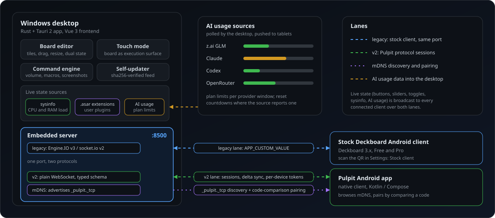

# Pulpit

[](LICENSE)
[](../../releases/latest)
[](../../actions/workflows/ci.yml)




Turn any tablet into a button board for your PC. Pulpit is a Windows desktop
app with a built-in board editor and touch surface, plus a network server
that phones and tablets connect to: buttons run commands, sliders drag,
dual-state tiles flip on live system state.

It started as a Rust rewrite of Deckboard 3.x and keeps full compatibility
with its ecosystem: the stock Deckboard Android client works out of the box,
`.boardjson` boards import and export unchanged, and original Deckboard
extensions load in a native runtime.

## Features



**Boards**

- Board editor: button/tile CRUD, drag and resize, dual-state styling,
  visible grid, live second-state preview.
- Touch mode: the board becomes the execution surface (configurable hotkey),
  with local execution, slider drag, and state-driven tile flips.
- `.boardjson` import/export, format-compatible with Deckboard.

**Commands and live state**

- Command engine: volume, mute and default-audio-device switching via WASAPI
  (no PowerShell dependency), key macros, text typing, screenshots, local
  audio playback, multi-actions, board switching.
- Live state: speaker volume, mute and device pushes; extension and
  custom-value state broadcast to every client.
- **AI usage panel**: plan limits with usage bars and reset countdowns for
  z.ai GLM, Claude, Codex and OpenRouter (or any custom JSON endpoint).
  Rows are auto-detected, the tile picks name-or-logo styling, and the
  whole thing is edited live from Ustawienia → AI usage.
- Native system-info source (CPU, RAM, audio) replaces the heaviest JS
  extensions.
- **Spotify**: playback, shuffle/repeat, like, playlists, device switch,
  volume and seek sliders, and a now-playing tile with cover art and a
  live progress bar. Talks to the Web API directly; setup and login live
  in the desktop app (see [Spotify](#spotify)).

**Pairing and clients**

- Two protocols on one port: the legacy socket.io v2 wire the stock Android
  client speaks, and Pulpit protocol v2 (plain WebSocket, typed schema,
  one-time QR pairing codes, per-device tokens, delta sync).
- Discovery pairing: the desktop advertises `_pulpit._tcp` over mDNS and a
  tablet pairs Bluetooth-style — the same numeric verification code shows on
  both screens. Manual code pairing and USB `adb reverse` stay for networks
  where multicast does not traverse.
- Native Android client (Kotlin/Compose): offline board cache, foreground
  keep-alive service, custom gestures (long-press, double-tap, swipes).

**Maintenance**

- Self-updater: the desktop checks a `latest.json` feed, downloads the
  release asset over HTTPS, verifies its sha256 and swaps itself with an
  automatic restart (Ustawienia → Aktualizacje).
- Tray, close-to-tray, autostart, single instance, daily-rotated logs.
- User extensions: original Deckboard `.asar` packages run in an embedded JS
  engine; system info, callurl, Discord and Voicemeeter have native Rust
  replacements.

## Install

Download `pulpit-desktop-*.exe` from
[Releases](../../releases/latest) (Windows 10/11, single binary, no
installer) and `Pulpit-*.apk` for the Android tablet. The desktop checks for
newer releases on its own and can update itself in place.

On first launch Pulpit copies an existing `~/deckboard` data directory
(database, settings, paired devices, extensions, assets) into `~/pulpitApp`,
so an upgrade from the original app needs no manual steps. The original app
keeps its files and keeps working.

The stock Deckboard Android app connects out of the box (scan the QR in the
editor's "Connect a tablet" panel). The native Pulpit client pairs either
from the mDNS discovery list (numeric code comparison on both screens) or by
typing a manually minted pairing code.

## Build from source

Prerequisites: a Rust toolchain (stable, MSVC), Node.js with npm, and for
the Android client JDK 17 + the Android SDK.

```sh
# desktop editor (dev mode, live reload)
cd apps/desktop
npm install
npm run tauri dev

# standalone release binary
npx tauri build --no-bundle   # exe at ../../target/release/pulpit-desktop.exe
```

Tests and lints run from the repo root:

```sh
cargo test --workspace        # includes real device tests: audio, screen capture
cargo clippy --workspace --all-targets
cd apps/desktop && npx vite build

# Android client unit tests
cd apps/mobile && gradle :app:testDebugUnitTest
```

## Data and configuration

Everything lives in `~/pulpitApp` (`pulpit_db::data_dir`): `database.db`,
`settings.json`, `editor.json`, `aidev.json`, `devices.json`, `spotify.json`,
`extensions/`, `assets/`, `logs/`. Environment overrides:

| Variable              | Default                   | Purpose                                     |
| --------------------- | ------------------------- | ------------------------------------------- |
| `PULPIT_PORT`         | `8500`                    | Server port (legacy + v2 share it)          |
| `PULPIT_DB`           | `~/pulpitApp/database.db` | Database location (profiling/hermetic runs) |
| `PULPIT_EXT_DIR`      | `~/pulpitApp/extensions`  | Extension directory                         |
| `PULPIT_AIDEV_CONFIG` | `~/pulpitApp/aidev.json`  | AI dev-work producer config                 |
| `PULPIT_NO_SINGLE_INSTANCE` | unset               | Set to `1` to run side-by-side instances    |
| `PULPIT_NO_DISCOVERY` | unset                     | Set to `1` to skip the mDNS announcement    |
| `PULPIT_SPOTIFY_CONFIG` | `~/pulpitApp/spotify.json` | Spotify client id and tokens           |

## Spotify

Pulpit talks to the Spotify Web API directly (native `crates/spotify`, no
extension). Login and configuration live only in the desktop app; tablets
just render and press the tiles.

**Setup (once)**

1. Create an app at <https://developer.spotify.com/dashboard>.
2. Add the redirect URI `http://127.0.0.1:8502/spotify/callback` exactly as
   written (the editor shows it with a copy button). Port 8502 is fixed and
   independent of `PULPIT_PORT`, because Spotify matches the URI exactly.
3. Paste the app's client id into Ustawienia → Spotify and log in. The
   browser opens, and after you approve, Pulpit catches the redirect on
   127.0.0.1:8502 (5-minute window). If something else holds 8502, the
   login fails with a clear error instead of picking another port.

Tokens are stored in `~/pulpitApp/spotify.json` (override the path with
`PULPIT_SPOTIFY_CONFIG`). Refresh-token rotation is handled and tokens are
never logged. Logging out deletes the tokens and keeps the client id. The
headless server reads the same file; without it Spotify is simply off.

**Tiles** (catalog group "Spotify")

| Kind | Does |
| --- | --- |
| `spotify-playback` | play/pause, next, previous, volume ±10 %, mute/restore |
| `spotify-shuffle` | toggle shuffle (lit while on) |
| `spotify-repeat` | cycle off → context → track (lit unless off) |
| `spotify-like` | save/unsave the current track (lit while saved) |
| `spotify-add` | add the current track to a chosen playlist |
| `spotify-tracks` | start a playlist, album, track or artist |
| `spotify-device` | move playback to a device (matched by name) |
| `spotify-volume` | slider, follows the live volume |
| `spotify-seek` | slider, follows track progress |
| `spotify-now-playing` | status tile: title, artist, album, cover, progress |

Playback control requires Spotify Premium (the Web API refuses it for Free
accounts; the status tiles still work). Spotify must be open on some device
first — Pulpit controls an existing player, it is not one. State is polled
about every 3 s while playing and every 20 s while paused. Pulpit sends no
requests at all while no tablet is connected and the editor window is
hidden. Tiles extrapolate track progress between polls.

## Architecture

One Cargo workspace, thin crates with a single job each:

| Crate            | Role                                                                  |
| ---------------- | --------------------------------------------------------------------- |
| `crates/db`      | SQLite access, schema, data dir + legacy migration                    |
| `crates/actions` | Command catalog and dispatch behind a testable `Input` seam           |
| `crates/os`      | Windows integration: WASAPI volume, capture, clipboard, playback      |
| `crates/sysinfo` | Native system-info source (volume/mute/device watcher)                |
| `crates/aidev`   | AI dev-work source: plan limits, agent status, local token sums       |
| `crates/legacy`  | Engine.IO v3 + socket.io v2 server for the stock Android client       |
| `crates/proto`   | Protocol v2 typed schema + TS bindings + golden JSON fixtures         |
| `crates/v2`      | v2 transport: sessions, pairing, devices, assets, state engine        |
| `crates/backend` | SQLite backend shared by the editor and the headless server           |
| `crates/ext`     | Extension host: original Deckboard extensions on an embedded JS engine|
| `crates/vm`      | Native Voicemeeter integration                                         |
| `crates/discord` | Native Discord local-RPC integration                                   |
| `apps/desktop`   | Tauri 2 + Vue 3 editor and touch surface                               |
| `apps/server`    | Headless server binary (legacy + v2)                                   |
| `apps/mobile`    | Kotlin/Compose Android client                                          |

Further reading:

- `docs/protocol-v2.md` — wire protocol, pairing, state sync
- `docs/decisions.md` — architecture decision records
- `ROADMAP.md` — milestones and status

## Compatibility with Deckboard

Pulpit is an independent project, not affiliated with Deckboard. It
interoperates with the Deckboard ecosystem on purpose: the stock Android
client (Free and Pro) connects to the legacy protocol, boards round-trip
through `.boardjson`, extensions load unmodified, and first launch migrates
your data instead of holding it hostage. Naming inside `settings.json`
(such as the `discord-deckboard` package) is preserved for compatibility.

## License

[MIT](LICENSE) - Tymoteusz "TymekTM" Bielski
